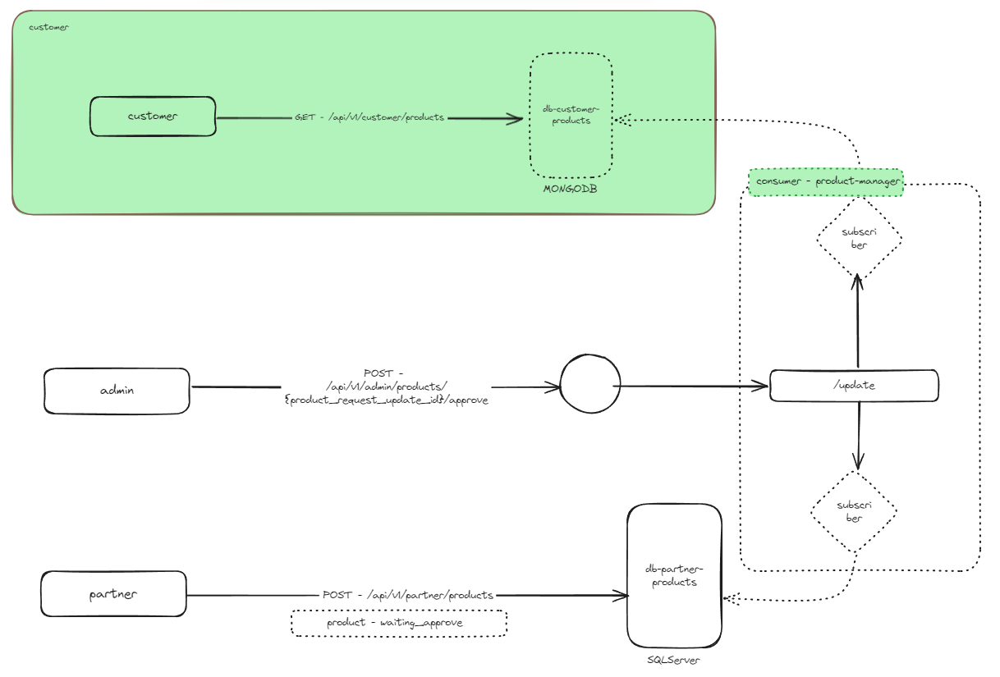
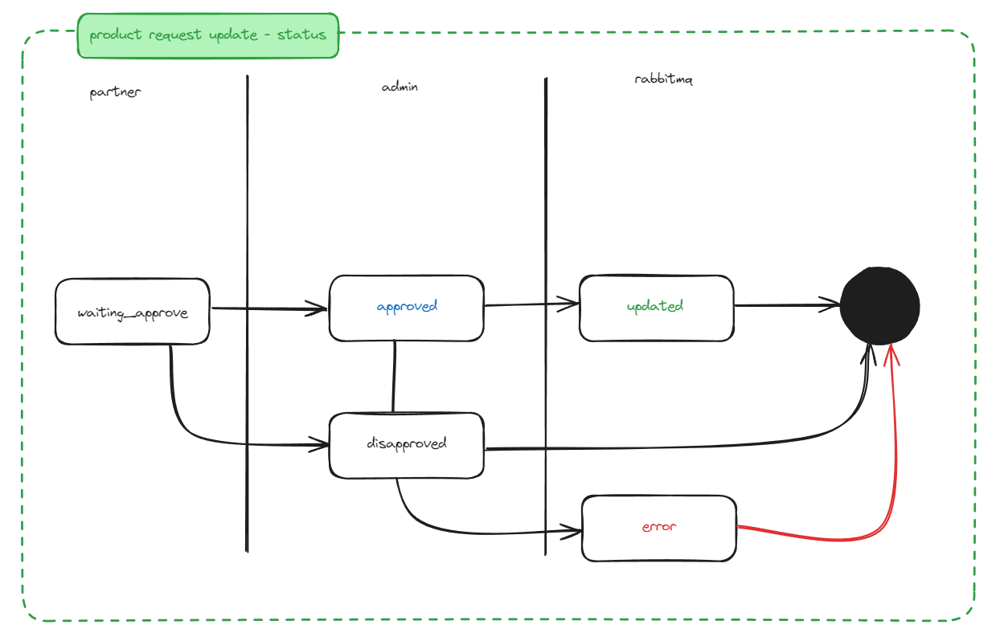

# Outbox Pattern Implementation Study with RabbitMQ, SQL Server, and MongoDB

## Project Description

  

This project aims to explore the Outbox pattern in a microservices architecture using RabbitMQ as the message broker. The study scenario involves the process of updating products in a system that integrates two databases: SQL Server and MongoDB.

### Scenario

1. **Product Registration and Update**:
   - A partner can register or edit a product through a request in the system.
   - After the request is created, an administrator reviews and either approves or rejects the modification.

2. **Processing via RabbitMQ**:
   - Upon approval of the modification, a message is sent to a RabbitMQ queue.
   - The queue uses the *Fanout* pattern, triggering multiple consumers simultaneously to process the insertion or update of the product in the databases.

3. **Database Updates**:
   - The product is identified using an `external_id`, which facilitates data synchronization between SQL Server (transactional database) and MongoDB (read database).
   - MongoDB is used as a read database to enhance performance for queries made by the client API.

4. **Error Handling**:
   - If an error occurs during the update processing, the status of the update request is changed to "Error."
   - If everything proceeds as expected, the product is updated in both databases, ensuring consistency.

5. **Query API**:
   - Clients access product data through an API that queries directly from MongoDB, taking advantage of the NoSQL database's speed for read operations.

### Technologies Used

- **RabbitMQ**: Manages event messages, utilizing the *Fanout* pattern to distribute updates to multiple consumers.
- **SQL Server**: Transactional database for storing primary product data.
- **MongoDB**: Read-optimized database for fast product data queries.

### Workflow

  

1. **Partner Registers Product Request Update**:
   - A partner registers a product update request.

2. **Request Status Initialization**:
   - The update request status is set to `waiting_approve`.

3. **Check Request Status**:
   - The system checks if the request status is `waiting_approve`.

4. **Admin Approves the Request**:
   - The administrator approves the product update request.

5. **Log Action** (Optional):
   - Log the administrator's action, including details like date, time, and request ID.

6. **Change Request Status to Approved**:
   - The status of the request is changed to `approved`.

7. **Add Request to Queue (Producer)**:
   - The product update request is added to the RabbitMQ queue for processing.

8. **Queue (Consumer) Process**:
   - The queue consumer processes the creation or update of the product using the `external_id` to identify the product in the databases.

9. **Update Product with Request Change**:
   - The product is updated in SQL Server and MongoDB with the changes specified in the request.

10. **Log Change History** (Optional):
    - Log the change history, including the old and new state of the product object. This can be useful for auditing.

11. **Change Request Status to Updated**:
    - If processing is successful, the status of the update request is changed to `updated`.

### Study Objectives

- Explore the use of the Outbox pattern to ensure consistency between databases.
- Study the integration between RabbitMQ and multiple databases.
- Implement efficient error handling to ensure operation integrity.
- Optimize data reading with MongoDB for performance in query operations.

## Conclusion

This project simulates a real-world product update scenario where RabbitMQ and the Outbox pattern ensure consistency and reliability in operations between different databases, with a focus on scalability and read performance.
